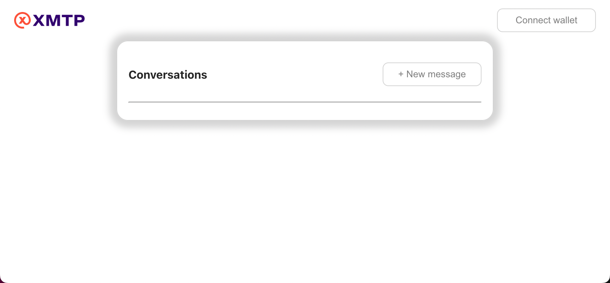
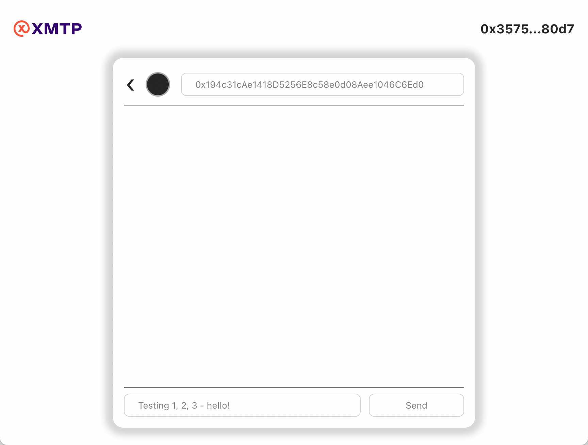

# Get started with the XMTP Quickstart React App

XMTP (Extensible Message Transport Protocol) is an open protocol and network for secure and private web3 messaging. For example, you can build an app with XMTP to provide messaging between blockchain accounts, including 1:1 chat, alerts, announcements, and more. To learn more, see [Introduction to XMTP](https://xmtp.org/docs/dev-concepts/introduction).

The XMTP Quickstart React App is an example app that you can use as a developer tool to learn how to build with XMTP. The app is intentionally built with lightweight code to help make it easier to parse and start learning to build with XMTP. For example, the app:

* Provides 1:1 chat functionality

* Supports MetaMask wallet app connections only

* Supports full wallet addresses only

The app is built in React and uses the following SDK and library:

* The [XMTP JavaScript SDK](https://github.com/xmtp/xmtp-js) for communicating with the XMTP network

* The [web3modal library](https://github.com/WalletConnect/web3modal) for enabling MetaMask to connect to the app

## Prerequisites

To install and run the XMTP Quickstart React App, you must have the following prerequisites installed:

* [Node](https://nodejs.org/en/download/) (LTS version) and npm to install and run the app

* [MetaMask](https://metamask.io/) browser extension to sign in to the app

   * It's also helpful to have a basic understanding of [how the MetaMask wallet app works](https://docs.metamask.io/guide/)

* A code editor of your choice, if you want to explore and build upon the app code

## Clone the repo

For example, run:

```bash
git clone git@github.com:xmtp/xmtp-quickstart-react.git
```

## Install the app

In the root directory of `xmtp-quickstart-react`, run:

```bash
npm install
```

## Run the app

```bash
npm start
```

The XMTP Quickstart React App opens at [http://localhost:3000/](http://localhost:3000/) in your default browser.

The app is running locally and is configured to connect to the XMTP `dev` network.



<!--- To learn how to get started building with XMTP, see Get started with building messaging between blockchain accounts using XMTP and React.-->

- For a quickstart guide to building with XMTP, see the [XMTP JavaScript SDK README](https://github.com/xmtp/xmtp-js#readme).

- To explore an example XMTP chat app with more advanced features, see the [example-chat-react app repo](https://github.com/xmtp/example-chat-react) and the [hosted example-chat-react app](https://xmtp.chat/).

Have questions or feedback?

* [XMTP Discord chat](https://discord.gg/xmtp)

* [XMTP Q&A GitHub discussion forum](https://github.com/orgs/xmtp/discussions)

## Use the XMTP Quickstart React App

1. Click **Connect wallet**.

2. The MetaMask wallet app extension appears. Select the wallet address (account) you want to use to send messages from using XMTP Quickstart React App. Click **Next**.

   Note that while the XMTP Quickstart React App intentionally supports MetaMask only, XMTP can be used with any Ethereum Virtual Machine-compatible wallet apps that support ECDSA signing on the secp256k1 elliptic curve. These include common wallet apps such as MetaMask, Coinbase Wallet, and Rainbow Wallet, as well as most wallet apps in the WalletConnect network. To learn more, see [Wallet apps and blockchains supported by XMTP](https://xmtp.org/docs/dev-concepts/wallets).

3. Confirm that you agree to connect your wallet address to the XMTP Quickstart React App. Click **Connect**.

4. At this point, you have connected your wallet address to the XMTP Quickstart React App using your MetaMask wallet. Next, you need to connect the XMTP Quickstart React App to the XMTP network. Click **Connect to XMTP**.

5. The MetaMask wallet app extension appears again. If this is your first time using an app built with XMTP, you are prompted to sign to create an XMTP identity. This is like creating a messaging account associated with your wallet address. Click **Sign**.

6. You are then prompted to enable your XMTP identity. This is like entering a password to access your messaging account. Click **Sign**.

   To learn more about these signatures, see [Sign to send and receive messages using apps built with XMTP](https://xmtp.org/docs/dev-concepts/signatures).

7. You are now ready to send a message. Click **New message** to start a new conversation.

8. Enter the full wallet address you want to send a message to. For example, you can message **_0x194c31cAe1418D5256E8c58e0d08Aee1046C6Ed0_** to say hello to the team working on advancing the development of XMTP.

   

   To send a message to a wallet address it must have an XMTP identity like the one you created in step 5. If the wallet address does not have an XMTP identity, the **Invalid wallet** error appears.

   Note that while the XMTP Quickstart React App intentionally supports full wallet addresses only, XMTP works with any web3 identities that apps built with XMTP can derive from Ethereum accounts, such as ENS names and Lens profiles. To learn more, see [Introduction to XMTP](https://xmtp.org/docs/dev-concepts/introduction).
